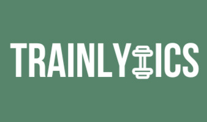

<p align="center">
    
</p>

<h1 align="center">Trainlytics</h1>
<p align="center"><em>
An open-source workout tracker for creating routines, logging real results, and tracking progress over time.
</em></p>

<p align="center">
  <a href="https://github.com/noahlacour/trainlytics/blob/main/LICENSE">
    
  </a>
  <a href="https://github.com/noahlacour/trainlytics/stargazers">
    
  </a>
</p>


---

## 🏋️ What is Trainlytics?

**Trainlytics** is a C++ backend system designed to help gym-goers:
- Build and save custom workout routines
- Log actual reps per set, with notes
- Save training logs locally in JSON format
- Easily extend functionailty for use in CLI, mobile apps, or web frontends (Coming in future)


---

## 🔧 Features

- ✅ Custom routine creation by exercise, muscle group, or equipment
- ✅ Log actual performance (reps per set, notes)
- ✅ Automatically timestamps workout with the current date
- ✅ JSON-based saving/loading systems (routines & logs)
- ✅ Modular architecture ready for frontend interface (Note: frontend interface will be developed and integrated after completeion of backend)

---

## 🚀 Getting Started

### 🛠 Prerequisites

- C++17-compatible compiler
- CMake ≥ 3.10
- [nlohmann/json](https://github.com/nlohmann/json) (already used)

### 🧪 Build and Run

```bash
git clone https://github.com/your-username/trainlytics.git
cd trainlytics
mkdir build && cd build
cmake ..
make
./trainlytics
```

---

## 🗺️ Roadmap

Here's what's planned for Trainlytics in upcoming updates:

### 🔹 Core Backend

- ✅ Modular C++ project setup
- ✅ Routine creation and JSON saving
- ✅ Workout logging with reps per set and notes
- ✅ Auto date-stamping with `<chrono>`
- [ ] Add support for logging **weights per set**
- [ ] CLI-based routine selector & input logger
- [ ] Load existing logs and compare over time

### 🔹 Advanced Features

- [ ] Visualize progress with terminal/graphing tools
- [ ] Create REST API layer for frontend communication
- [ ] Add unit testing and CI/CD support

### 🔹 Frontend & Cross-Platform Goals

- [ ] Build basic CLI menu interface
- [ ] Mobile app frontend (Flutter/React Native)
- [ ] User accounts or profiles (multi-user support)
- [ ] Cloud sync / export options


