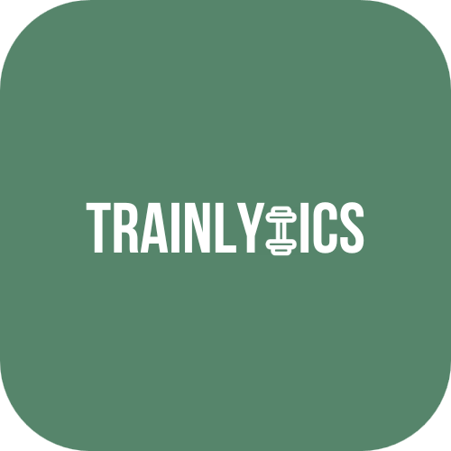

<p align="center">
    
</p>

<h1 align="center">Trainlytics</h1>
<p align="center"><em>
An open-source workout tracker for creating routines, logging real results, and tracking progress over time.
</em></p>

<p align="center">
  <a href="https://github.com/noahlacour/trainlytics/blob/main/LICENSE">
    
  </a>
  <a href="https://github.com/noahlacour/trainlytics/stargazers">
    
  </a>
</p>


---

## 🏋️ What is Trainlytics?

**Trainlytics** is a C++ backend system designed to help gym-goers:
- Build and save custom workout routines
- Log actual reps per set, with notes
- Save training logs locally in JSON format
- Easily extend functionailty for use in CLI, mobile apps, or web frontends (Coming in future)


---

## 🔧 Features

- ✅ Custom routine creation by exercise, muscle group, or equipment
- ✅ Log actual performance (reps per set, notes)
- ✅ Automatically timestamps workout with the current date
- ✅ JSON-based saving/loading systems (routines & logs)
- ✅ Modular architecture ready for frontend interface (Note: frontend interface will be developed and integrated after completeion of backend)

---

## 🚀 Getting Started

### 🛠 Prerequisites

- C++17-compatible compiler
- CMake ≥ 3.10
- [nlohmann/json](https://github.com/nlohmann/json) (already used)

### 🧪 Build and Run

```bash
git clone https://github.com/your-username/trainlytics.git
cd trainlytics
mkdir build && cd build
cmake ..
make
./trainlytics
```

---

## 🗺️ Roadmap

Here's what's planned for Trainlytics in upcoming updates:

### 🔧 Core Backend

- [x] ✅ Modular C++ project structure with CMake
- [x] ✅ Create and serialize routines (JSON-based)
- [x] ✅ Log reps **and weights per set** with notes
- [x] ✅ Timestamp workouts using `<chrono>`
- [x] ✅ Unit tests using Doctest
- [x] ✅ Add CLI test mode with `--log` flag
- [ ] ⌨️ Interactive CLI routine selector and logger
- [ ] 📂 Load and compare historical logs
- [ ] 📊 JSON-based progress analysis interface

---

### 🚀 Advanced Features

- [ ] 📈 Terminal graphing (weights/reps over time)
- [ ] 🌐 REST API layer for future frontend integration
- [ ] 🧪 GitHub Actions CI for builds and test coverage
- [ ] 🧰 Export workouts (CSV, Markdown, JSON)

---

### 🖥️ Frontend & Cross-Platform Vision

- [ ] 🧭 Menu-driven CLI interface
- [ ] 📱 Mobile app frontend (Flutter or React Native)
- [ ] 👥 Multi-user support (profiles/workout history)
- [ ] ☁️ Cloud sync, backup & export options (e.g., Dropbox/GitHub)


